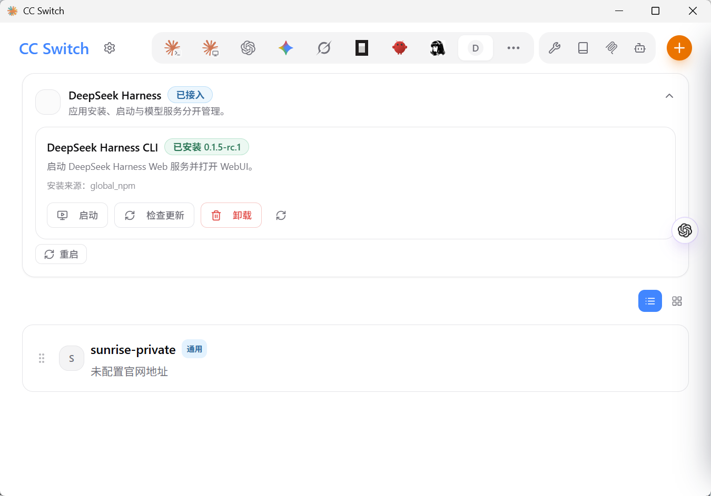
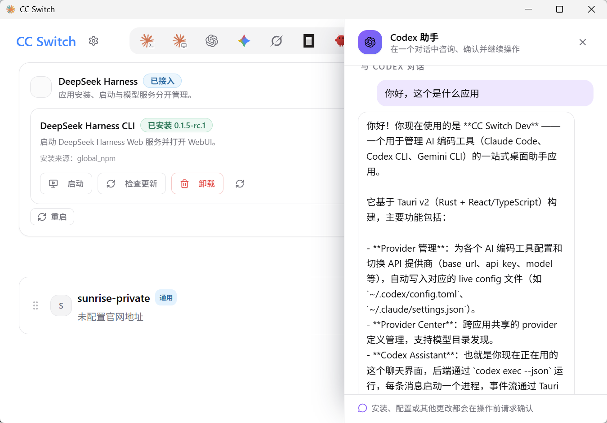
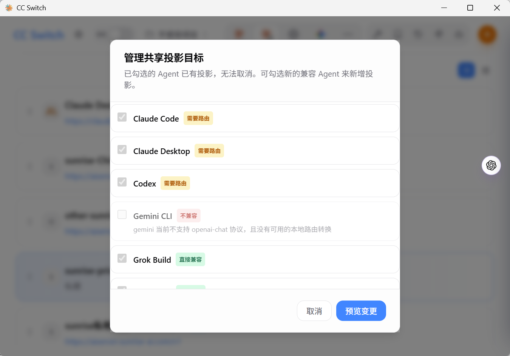
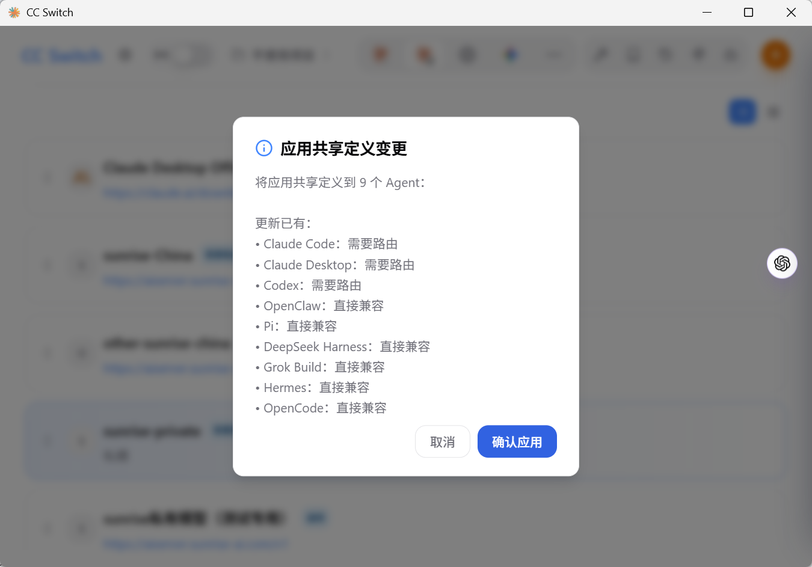
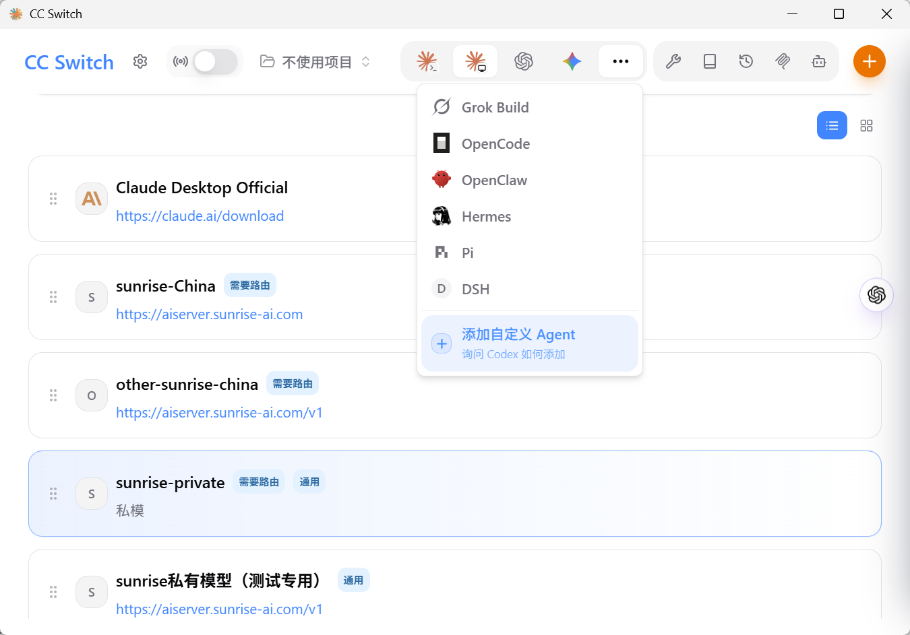

<div align="center">

# CC Switch Dev

### CC Switch 魔改版 — Provider 管理 + 内置 AI 助手 + Agent 生命周期

基于 [CC Switch](https://github.com/farion1231/cc-switch) v3.20.2 二次开发，保留原版全部功能，新增内置 Codex 助手、通用 Provider 体系、Agent 启动器、DeepLink 导入、桌面生命周期管理等特性。

[](https://github.com/advance-lion/cc-switch/releases)
[](https://github.com/advance-lion/cc-switch/releases)
[](https://tauri.app/)

[下载最新版本](https://github.com/advance-lion/cc-switch/releases/latest) | [完整特性清单](FEATURES.md)

</div>

---

## 与原版 CC Switch 的区别

| 维度 | CC Switch (原版) | CC Switch Dev |
|------|-------------------|---------------|
| 定位 | Provider 配置管理器 | Provider 管理 + AI 助手 + Agent 生命周期 |
| 首页 | 仅 Provider 列表 | Agent 启动器 + Provider 列表 + 浮窗助手 |
| Codex 助手 | 无 | 内建浮窗 Dock，完整对话能力 |
| 通用 Provider | 无 | 跨 Agent 复用，一键映射到新安装的 Agent |
| Provider Center | 无 | 统一管理 + 投影 + 路由徽章 |
| DeepLink 导入 | 无 | URL 导入 + 风险评估 + 预览确认 |
| DSH 集成 | 无 | 桌面生命周期 + Provider 投影 |
| Hermes | 无 | 桌面检测 + 生命周期管理 |
| 代理模式 | 无 | 一键启停 + takeover 状态 |
| 会话持久化 | N/A | 关闭面板不杀任务，后台持续运行 |
| AGENTS.md | 无 | 自动注入项目上下文 |
| 安装包名 | CC Switch | CC Switch Dev |
| 配置目录 | com.ccswitch.desktop | com.ccswitch.desktop.dev |

> CC Switch Dev 与原版 CC Switch 可共存安装，配置目录独立，互不影响。

---

## 核心新特性

### 1. 内置 Codex 助手

右侧浮窗按钮，点击展开对话面板，直接和 Codex CLI 对话。不需要打开终端，不需要切换页面。



**面板展开后**：顶部显示就绪状态（CLI 版本 + Provider 配置），中间是对话区，底部是运行日志。



**对话进行中**：流式输出实时显示，命令执行前弹出审批卡片。



#### 会话持久化

关闭 Dock 面板不会终止后端任务。任务在后台继续运行，对话上下文保留。重新打开面板即可看到完整对话记录。

#### 未读 / 运行中指示器

浮窗按钮在有任务运行或有未读消息时显示紫色脉动圆点，从任意页面可见。打开面板后自动清除。



#### AGENTS.md 知识注入

创建会话时自动在工作目录写入 `AGENTS.md`，描述项目架构和关键模块路径。Codex CLI 启动时自动读取，零代码改动。

#### 后端接入

- 通过 `codex exec` 命令以 `danger-full-access` 权限运行
- Rust 后端管理进程生命周期：启动、stdout/stderr 读取、取消
- 审批策略：命令执行前弹出 Approval Card，可单次 / 本会话 / 全局放行
- 停止按钮：generation 版本号机制，避免旧 reader 竞态挂起

---

### 2. Agent 启动器

首页每个 Agent 标签页顶部显示 `RuntimeLifecycleCard`：

- 安装状态检测（版本号、安装路径、安装方式）
- 一键安装 / 卸载按钮
- AI 安装按钮：点击后直接打开 Codex 助手 Dock，把安装意图传给 AI，让 AI 帮你完成安装
- 支持 Claude Code、Codex CLI、Gemini CLI、DeepSeek Harness、Hermes 等多种 Agent

---

### 3. 通用 Provider 体系

#### 通用 Provider

添加 Provider 时可选择保存范围：

- **通用 Provider**：跨 Agent 复用，保存后不直接修改 Agent 配置，而是创建一个 Provider Center 管理草稿
- **仅当前 Agent**：只写入当前 Agent 的配置文件

#### 一键映射

通用 Provider 保存后通过 Provider Center 投影到各个 Agent：

- 选择目标 Agent（可多选），一键投影
- 投影前预览配置差异，确认后再写入
- 新安装的 Agent 可以从已有通用 Provider 一键映射过来，无需重新配置
- 编辑通用 Provider 时显示已绑定的 Agent 列表，修改后同步更新所有投影

#### Provider 删除选项

删除时提供三种选择：

1. 从指定 Agent 移除投影并解除绑定
2. 保留配置但解除通用 Provider 绑定
3. 删除所有投影、绑定和通用 Provider 定义

---

### 4. Provider Center



- 统一管理所有 Agent 的 Provider 配置
- 管理投影（通用 Provider 到 Agent 配置的映射）
- Codex routing badge：显示当前路由状态
- 管理草稿：预览配置差异，确认后写入
- 绑定目标锁定：防止误修改已绑定的 Agent

---

### 5. DeepLink 导入

通过 URL 一键导入 Provider 配置：

- 支持 base64 编码的配置载荷
- 导入前显示配置预览（敏感信息脱敏）
- 风险评估：自动检测高风险配置项
- 三种确认弹窗：Provider 配置确认、Skill 确认、MCP 确认
- 安全提示：挂条件等于让攻击者省略参数就能导入，需用户确认

---

### 6. 桌面生命周期管理

#### DeepSeek Harness (DSH)

- 检测安装状态（bootstrap / unpacked 两种安装方式）
- 启动 / 停止 / 重启 DSH 桌面进程
- 就绪检查：等待 HTTP 端口可用
- 跨平台启动脚本，可靠的重启逻辑
- Provider 配置共享投影到 Provider Center

#### Hermes 桌面

- 检测 Hermes 桌面应用安装状态（bootstrap / unpacked）
- 桌面生命周期集成：启动、就绪检查、停止
- 与 Provider Center 联动

#### CLI 生命周期任务

- 安装过程子进程输出实时落库（lifecycle_jobs）
- 应用重启后恢复进行中的任务
- 任务可取消，日志可查看

---

### 7. 代理模式

- 头部 ProxyToggle 开关，一键启停代理模式
- Takeover 状态检测：显示当前是否处于接管状态
- Codex 代理增强：
  - image edits 端点代理修复
  - 媒体启发式：根据纯文本模型注册表自动剥离图片
  - `requires_openai_auth` 标记：takeover 写入时自动盖戳，匹配实时登录状态

---

### 8. 其他增强

- **数据库 v18**：Schema 升级，199 条默认模型定价数据
- **Subscription Quota**：订阅配额显示，支持官方订阅和 Token Plan
- **数据库升级检测**：检测到旧版本数据库时提供一键升级入口
- **备份与恢复**：备份列表管理，定时备份（24 小时间隔）
- **导入导出**：Provider 配置批量导入导出
- **Unified Skills Panel**：技能管理面板
- **Hermes Memory Panel**：记忆管理面板

---

## 安装

### Windows

从 [GitHub Release](https://github.com/advance-lion/cc-switch/releases/latest) 下载 `CC Switch Dev_x.x.x_x64-setup.exe`，双击安装。

CC Switch Dev 与原版 CC Switch 可共存安装，不会互相覆盖。

### 从源码构建

```bash
git clone https://github.com/advance-lion/cc-switch.git
cd cc-switch
pnpm install
pnpm tauri build
```

安装包输出在 `src-tauri/target/release/bundle/nsis/`。

---

## 技术栈

- **前端**：React + TypeScript + Tailwind CSS + Vite
- **后端**：Rust + Tauri v2
- **AI 助手**：Codex CLI (codex exec) + app-server 协议
- **桌面集成**：DSH / Hermes 桌面生命周期管理
- **数据库**：SQLite (v18 schema) + 199 条默认定价数据

---

## 致谢

基于 [CC Switch](https://github.com/farion1231/cc-switch) by [farion1231](https://github.com/farion1231) 二次开发。感谢原版作者的开源贡献。

## License

MIT
